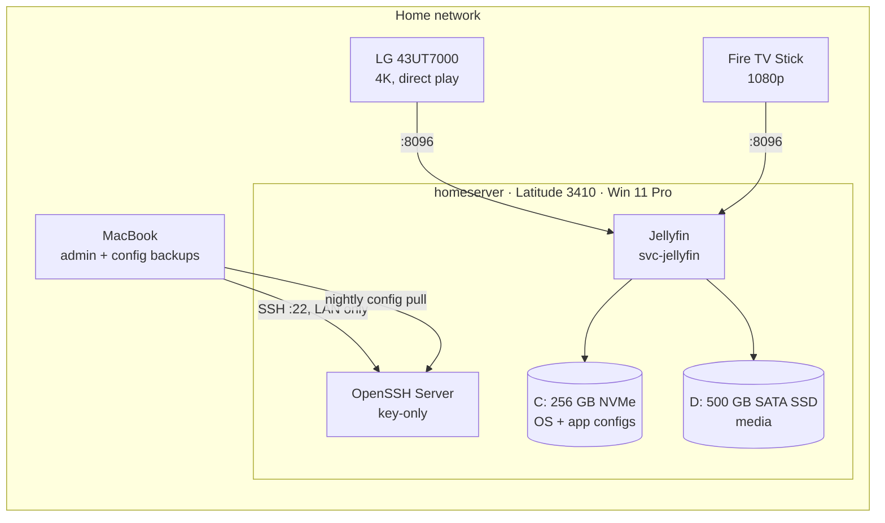

# jellyfin-home-server

Turning an old Dell Latitude 3410 laptop into a home media server: a clean, hardened Windows 11 Pro machine running Jellyfin as a Windows service, managed over SSH from a Mac. No Docker, everything native.

This repo holds the runbooks, scripts, decision records and a log of what went wrong along the way.

## Status

| Phase | Scope | Status |
|---|---|---|
| 1. Clean rebuild | Backup, malware scan, BIOS update, hardware upgrade, clean Windows 11 Pro install | 🟡 In progress, [runbook](docs/phase-1-rebuild.md) |
| 2. SSH + Jellyfin | OpenSSH (key-only, LAN-only), power/update policy, Jellyfin as a low-privilege service, Quick Sync transcoding, config backups | ⚪ Planned, [outline](docs/phase-2-jellyfin-ssh.md) |
| 3. Automation | qBittorrent, Sonarr, Radarr, Prowlarr as native services with hardlinked media | ⚪ Planned after Phase 2 |

## Architecture



Nothing is exposed to the internet. Remote viewing is out of scope.

## Hardware

| | |
|---|---|
| Machine | Dell Latitude 3410 (laptop) |
| CPU / GPU | Intel i5-10210U, 4C/8T / UHD 620 (Quick Sync: HEVC 10-bit decode and encode) |
| RAM | 8 GB |
| Storage | 256 GB NVMe (OS) + 500 GB 2.5" SATA SSD (media) |
| Battery | 16% health, kept in with a BIOS charge limit (Primarily AC Use) |
| Budget | ~$100 CAD for upgrades |

## Repo layout

```
docs/
  phase-1-rebuild.md        step-by-step runbook
  phase-2-jellyfin-ssh.md   outline, becomes a runbook when Phase 1 is done
  decisions/                why things are the way they are (short ADRs)
  roadblocks/               problems hit: Problem → Tried → Cause → Fix → Learned
  img/                      teardown photos and screenshots
scripts/
  mac/                      run on the admin Mac (build the USB stick, scan the backup)
  windows/                  run on the server (pre-wipe checks, backup)
JOURNAL.md                  dated log of the whole build
```

## Content

The server is used with content I have the rights to: my own rips, public-domain and Creative Commons films. Screenshots in this repo only show public-domain titles.

## License

[MIT](LICENSE)
